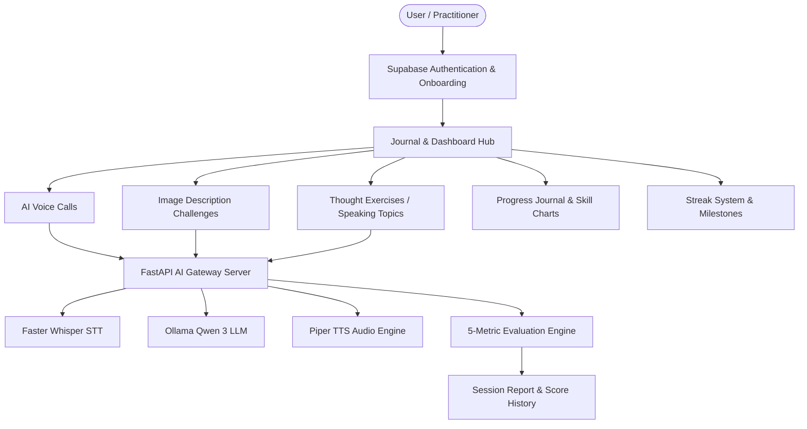
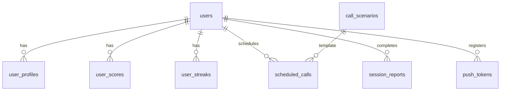

# Fluento — Comprehensive Architecture, Technical Manual & Operating Guide

Welcome to the definitive guide for **Fluento**, an AI-powered spoken communication training platform engineered to help users master spoken communication through structured, real-time practice and personalized feedback.

Unlike conventional language learning tools focused on passive grammar drills and vocabulary flashcards, Fluento treats communication as an active physical and cognitive skill—analogous to physical fitness.

---

## 1. Platform Overview & Core Feature Pillars

Fluento provides a complete ecosystem for voice-first communication training across Web and Mobile interfaces:



### Key Training Modes

1. **Scheduled AI Voice Calls (Phase 7 & Phase 12):**
   - Interactive roleplay scenarios (Job Interviews, Sales Pitches, Executive Briefings, Casual Conversations).
   - Real-time conversation turns powered by AI persona dialog generation.
   - Scheduled booking with background push notification queue dispatcher and interactive Accept/Decline action handlers.
   - Automatic overdue handling for missed calls.

2. **Image Description Challenges (Phase 8):**
   - Visual observation practice across 4 specialized modes:
     - **Standard Mode:** General descriptive observation.
     - **Forbidden Words Mode:** Describe without using key high-frequency nouns/verbs.
     - **Emotion Mode:** Convey a specific emotional atmosphere (e.g., *Nostalgic*, *Joyful*, *Tense*).
     - **Perspective Mode:** Adopt a designated persona perspective (e.g., *Journalist*, *Poet*, *Child*).

3. **Thought Exercises / Speaking Topics (Phase 9):**
   - Spontaneous speaking practice categorized by `Personal`, `Professional`, `Opinion`, and `General`.
   - 3 challenge formats:
     - **Monologue Mode:** Sustained structured presentation.
     - **Quick Thinking Mode:** 30-second countdown preparation timer before recording.
     - **Debate Mode:** Defending an opinion against counterarguments.

4. **Progress Journal & Skill Analytics (Phase 10):**
   - Multi-metric communication score tracking across 5 core skills:
     - **Fluency:** Speech rhythm, flow, and absence of filler hesitations.
     - **Grammar:** Structural accuracy and tense consistency.
     - **Vocabulary:** Word choice variety and precision.
     - **Observation / Clarity:** Detail recognition and message structure.
     - **Expressiveness / Argument Strength:** Tone, persuasiveness, and reasoning.
   - Recharts visual trend lines with range filters (`Daily`, `Weekly`, `Monthly`, `All-Time`).
   - Personal records grid, rolling score averages, and dynamic AI recommendations.

5. **Streak System & Milestones (Phase 11):**
   - Daily activity recording upon session completion.
   - Interactive monthly practice calendar grid visualizer.
   - Milestone progress badges for 3-Day, 7-Day, 14-Day, 30-Day, and 100-Day consistency tiers.

6. **Automated Notification System (Phase 12):**
   - Background cron scheduler executing every minute.
   - High-priority push payload dispatch via Expo Server Push API.
   - Delivery logging to `activity_log` with single-retry reliability.

---

## 2. Monorepo Architecture & Technology Stack

Fluento is structured as a TypeScript monorepo managed with `pnpm` workspaces and `turbo`.

```text
fluento/
├── apps/
│   ├── api/                  # NestJS 10 Backend API (Fastify engine)
│   ├── web/                  # Next.js 15 Web Application (React 19 & TailwindCSS)
│   └── mobile/               # React Native Mobile Application (Expo SDK 51 & Expo Router)
├── packages/
│   └── shared/               # Shared TypeScript types, DTOs, and Zod schemas
├── docker/
│   ├── ai-server/            # Python 3.11 FastAPI AI Server (Whisper, Qwen, Piper)
│   └── docker-compose.yml     # Development Docker environment composition
```

### Core Architecture Components

| Layer | Framework / Library | Primary Responsibility |
| :--- | :--- | :--- |
| **Backend API** | NestJS 10 + Fastify | Modular REST API endpoints, JWT auth guards, database access wrapper, notification scheduler. |
| **Web Frontend** | Next.js 15 + TailwindCSS | Editorial "Warm Paper" design system, responsive UI, Zustand stores, TanStack React Query, Recharts charts. |
| **Mobile App** | React Native + Expo SDK 51 | Cross-platform iOS/Android app, Expo Router navigation, Zustand stores, Expo Notifications, audio capture. |
| **Shared Package** | `@fluento/shared` | Centralized Zod validation schemas, TypeScript interfaces, and DTO definitions. |
| **Database** | PostgreSQL (Supabase) | Row-Level Security (RLS) policies, relation tables, automated score rolling calculations. |
| **AI Gateway** | FastAPI (Python 3.11) | Local Faster Whisper STT, Ollama Qwen 3 LLM, and Piper TTS audio synthesis pipelines. |

---

## 3. Database Schema & Data Models

The database schema is defined across 3 SQL migration scripts in `apps/api/src/database/migrations/`:



### Core Database Tables

1. `users`: Supabase auth identity wrapper storing email, full name, and timestamps.
2. `user_profiles`: Stores onboarding goals (`interview_preparation`, `improve_fluency`, etc.) and skill levels.
3. `user_scores`: Current rolling averages for `fluency`, `grammar`, `vocabulary`, `observation`, `expressiveness`.
4. `score_history`: Log of historical score points recorded per completed session.
5. `user_streaks`: Tracks `current_streak`, `best_streak`, and `last_activity_date`.
6. `call_scenarios`: Active roleplay scenario templates with persona name, role, and system prompts.
7. `scheduled_calls`: Call bookings with status (`scheduled`, `active`, `completed`, `missed`) and JSON conversation history.
8. `session_reports`: Post-session evaluation results storing score JSON, feedback, strengths, improvements, and recommendations.
9. `images`: Image study challenge assets with image URL, metadata, tags, and difficulty.
10. `topics`: Speaking topics categorized by `personal`, `professional`, `opinion`, `general`.
11. `activity_log`: Audit trail for call schedules, starts, completions, and push notification dispatches.
12. `push_tokens`: Device push tokens registered for mobile and web notifications.

---

## 4. How to Start and Run the Application Locally

Follow these step-by-step instructions to set up, run, and test Fluento on your local computer.

### Step 1: Prerequisites Check

Ensure you have the following installed on your machine:
- **Node.js:** `>= 20.0.0`
- **pnpm:** `9.15.9` (or `pnpm >= 9.0.0`)
- **Docker & Docker Compose:** *(Optional, required only if running local AI models)*
- **Supabase Account or Local Supabase Instance:** Required for database and authentication.

---

### Step 2: Install Dependencies & Build Shared Package

Open your terminal in the root repository directory (`c:\Users\KIIT0001\Fluento`) and run:

```bash
# 1. Install monorepo dependencies across all packages
pnpm install

# 2. Build the shared package (@fluento/shared)
pnpm build:shared
```

---

### Step 3: Configure Environment Variables

Create `.env` files for each service based on the templates below:

#### 1. Backend API (`apps/api/.env`)
```env
PORT=3001
NODE_ENV=development
SUPABASE_URL=https://your-supabase-project.supabase.co
SUPABASE_ANON_KEY=your-supabase-anon-key
SUPABASE_SERVICE_ROLE_KEY=your-supabase-service-role-key
ADMIN_EMAILS=admin@fluento.app
AI_SERVER_URL=http://localhost:8000
EXPO_ACCESS_TOKEN=your-expo-access-token
```

#### 2. Web Frontend (`apps/web/.env.local`)
```env
NEXT_PUBLIC_API_URL=http://localhost:3001
NEXT_PUBLIC_SUPABASE_URL=https://your-supabase-project.supabase.co
NEXT_PUBLIC_SUPABASE_ANON_KEY=your-supabase-anon-key
NEXT_PUBLIC_APP_URL=http://localhost:3000
```

#### 3. Mobile App (`apps/mobile/.env`)
```env
API_URL=http://localhost:3001
EXPO_PUBLIC_SUPABASE_URL=https://your-supabase-project.supabase.co
EXPO_PUBLIC_SUPABASE_ANON_KEY=your-supabase-anon-key
```

---

### Step 4: Run Database Migrations & Seed Data

In your Supabase SQL Editor (or via Supabase CLI), run the migration SQL scripts located in `apps/api/src/database/migrations/` in numerical order:

1. Execute `001_auth_and_users.sql` (Creates users, profiles, scores, streaks tables & RLS policies).
2. Execute `002_content_and_sessions.sql` (Creates scenarios, calls, reports, images, topics tables).
3. Execute `003_fix_declined_to_missed.sql` (Ensures status compatibility).
4. Execute `003_seed_data.sql` (Populates default roleplay scenarios, image challenges, and speaking topics).

---

### Step 5: Launching the Applications

You can launch all applications simultaneously using Turborepo, or run services individually:

#### Option A: Launch All Applications Together (Recommended)

From the root directory, execute:

```bash
pnpm dev
```

This single command will concurrently start:
- **NestJS Backend API:** Runs at `http://localhost:3001`
- **Next.js Web Frontend:** Runs at `http://localhost:3000`
- **Expo Mobile App CLI:** Runs interactive Metro bundler in your terminal

---

#### Option B: Launch Services Individually

##### 1. Start Backend API Only
```bash
pnpm dev:api
```
- API Base URL: `http://localhost:3001`
- Swagger API Interactive Documentation: `http://localhost:3001/api/docs`

##### 2. Start Web Frontend Only
```bash
pnpm dev:web
```
- Web Application: `http://localhost:3000`

##### 3. Start Mobile App Only
```bash
pnpm dev:mobile
```
- Press `w` in terminal to launch in **Browser Web View**.
- Press `a` in terminal to launch in **Android Emulator**.
- Press `i` in terminal to launch in **iOS Simulator**.
- Scan the printed QR code with the **Expo Go** app on your physical iOS/Android device!

---

#### Option C: (Optional) Launch AI Gateway Docker Services

If you wish to test with local AI model generation (Faster Whisper STT, Ollama Qwen 3 LLM, Piper TTS):

```bash
cd docker
docker-compose up -d
```
- Ollama Container: `http://localhost:11434`
- Python AI Server Container: `http://localhost:8000`
- FastAPI Health Diagnostic: `http://localhost:8000/health`

*(Note: If the AI Server container is offline, NestJS automatically uses robust deterministic evaluation fallbacks so the app remains 100% functional for testing!)*

---

## 5. Step-by-Step Testing Walkthrough for Yourself

Once your backend and frontend apps are running, test the complete user experience following this walkthrough:

### 1. Account Creation & Onboarding
1. Open `http://localhost:3000` in your web browser (or open the Mobile app).
2. Click **Get Started** or **Register**.
3. Create a new account with your email, name, and password.
4. Complete the **Onboarding Survey**:
   - Select your practice goals (e.g. *Interview Preparation*, *Improve Fluency*).
   - Select your skill level (*Intermediate*).
5. Submit to reach your **Communication Journal Dashboard**.

### 2. Testing Scheduled Voice Calls (Phase 7 & 12)
1. Go to **Voice Calls** from the navigation header/tabs.
2. Click **Schedule a Call**.
3. Select a scenario (e.g., *Software Engineer Technical Interview* or *Product Demo Sales Call*).
4. Select a scheduled date and time in the future and click **Schedule Call**.
5. Return to the Calls hub. Click **Start Call** on your upcoming call card to enter the active **Call Room**.
6. Speak into your microphone (or type text turns).
7. Notice real-time turn submission, live transcript feed, count-up timer, and AI persona responses.
8. Click **End Call**.
9. View your comprehensive **Session Report**:
   - Scores for Fluency, Grammar, Vocabulary, Confidence, Coherence.
   - Qualitative feedback summary.
   - Key strengths, areas for improvement, and actionable recommendations.

### 3. Testing Image Description Challenges (Phase 8)
1. Go to **Practice** -> **Image Studies**.
2. Select a challenge mode:
   - **Forbidden Words Mode:** Describe the image without using forbidden words listed on screen.
   - **Emotion Mode:** Capture a specific mood (e.g., *Nostalgic*).
3. Record your description or type your text response.
4. Click **Submit Description**.
5. Inspect the evaluation report featuring Observation and Expressiveness score cards.

### 4. Testing Thought Exercises (Phase 9)
1. Go to **Practice** -> **Thought Exercises**.
2. Select a topic category (*Professional*, *Opinion*, *Personal*, *General*).
3. Select a mode (*Monologue*, *Quick Thinking* with 30s prep countdown, or *Debate*).
4. Record your response and submit.
5. Review the AI speech coach feedback and argument strength metrics.

### 5. Inspecting Progress Journal & Streak Calendar (Phase 10 & 11)
1. Navigate to the **Communication Journal** (`http://localhost:3000/journal`).
2. Toggle time range filters (**Daily**, **Weekly**, **Monthly**, **All-Time**).
3. View your Recharts visual skill trend line chart tracking all 5 communication skills over time.
4. Inspect your Personal Bests grid, rolling average skill breakdown, recent activity logs, dynamic AI recommendations, and monthly streak calendar.

### 6. Executing Monorepo Automated Tests (Phase 14)
Run automated unit, integration, and E2E tests across all 5 workspace projects:

```bash
# Run all automated test suites across monorepo
pnpm test

# Run TypeScript compilation check
pnpm type-check
```

All 45+ test cases will execute and pass cleanly with 0 compilation errors!

---

## 6. Summary of Workspace Verification Commands

| Action | Terminal Command | Target / Output |
| :--- | :--- | :--- |
| **Install All Dependencies** | `pnpm install` | Installs dependencies across root, api, web, mobile, shared. |
| **Build Shared Package** | `pnpm build:shared` | Compiles `@fluento/shared` Zod schemas & TypeScript types. |
| **Start Monorepo Dev Server** | `pnpm dev` | Runs Backend (3001), Web (3000), and Mobile CLI concurrently. |
| **Run Monorepo Tests** | `pnpm test` | Runs Jest unit and integration suites across all workspace projects. |
| **Run Type Check** | `pnpm type-check` | Runs `tsc --noEmit` across all 4 TypeScript packages. |
| **Run Linter** | `pnpm lint` | Runs ESLint across all projects. |

---

*Enjoy practicing with Fluento! If you have any questions or need further customizations, check `PROJECT_CURRENT_STATUS.md` and `PHASE_ROADMAP_AUDIT.md` in the workspace root.*
