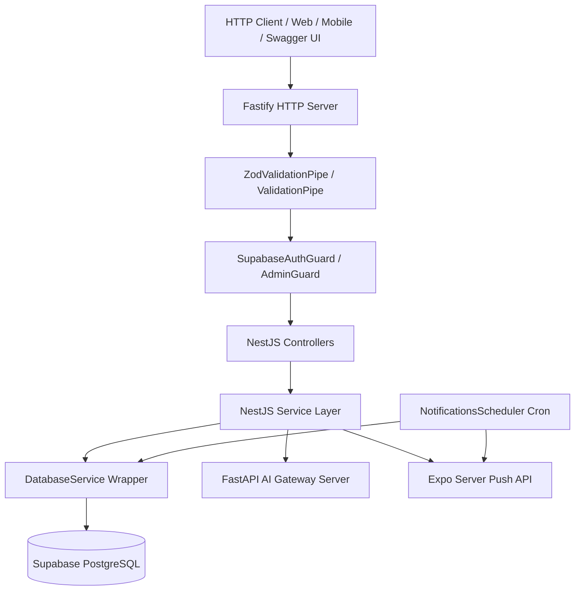

# Fluento Backend API — Complete Codebase Architecture & Technical Execution Manual

This document provides a comprehensive, file-by-file, function-by-function technical breakdown of the Fluento NestJS Backend API (`apps/api`).

---

## 1. Overview & Architectural Pattern

The Fluento Backend API is built using **NestJS 10** running on top of **Fastify** (`@nestjs/platform-fastify`) for high-throughput HTTP performance. It follows a **Modular Monolith** architecture pattern with strict separation of concerns between controllers, services, database wrappers, auth guards, and background schedulers.



---

## 2. Directory & File Inventory

```text
apps/api/
├── nest-cli.json                     # NestJS CLI configuration
├── package.json                      # API dependencies and scripts
├── tsconfig.json                     # TypeScript compiler options
├── jest.config.json                  # Jest test harness config
├── ApiExplaination.md                # Technical Manual (this file)
├── src/
│   ├── main.ts                       # Application entrypoint & Fastify boot
│   ├── app.module.ts                 # Root application module
│   ├── common/                       # Cross-cutting utilities
│   │   ├── decorators/
│   │   │   └── current-user.decorator.ts # Custom @CurrentUser() parameter decorator
│   │   ├── filters/
│   │   │   └── global-exception.filter.ts # Global HTTP exception filter & logger
│   │   ├── guards/
│   │   │   ├── supabase-auth.guard.ts     # JWT Supabase Bearer token auth guard
│   │   │   └── admin.guard.ts             # Admin email authorization guard
│   │   └── pipes/
│   │       └── zod-validation.pipe.ts     # Zod DTO schema validation pipe
│   ├── database/                     # Core database persistence layer
│   │   ├── database.constants.ts     # Injection tokens (SUPABASE_CLIENT)
│   │   ├── database.module.ts        # Global DatabaseModule
│   │   ├── database.service.ts       # Supabase CRUD wrapper & score calculation
│   │   ├── database.service.spec.ts  # DatabaseService unit tests
│   │   └── migrations/
│   │       ├── 001_auth_and_users.sql # User tables & RLS policies
│   │       ├── 002_content_and_sessions.sql # Calls, topics, images, reports tables
│   │       ├── 003_fix_declined_to_missed.sql # Compatible call status enum
│   │       └── 003_seed_data.sql     # Seed scenarios, topics, and images
│   └── modules/                      # Domain feature modules
│       ├── admin/                    # Content management module
│       ├── auth/                     # Authentication & JWT token module
│       ├── calls/                    # AI Voice Call scheduling & turn execution
│       ├── challenges/               # Image study & thought exercise submissions
│       ├── evaluation/               # AI 5-metric scoring & fallback engine
│       ├── images/                   # Image study asset retrieval
│       ├── notifications/            # Push dispatch & 1-min cron scheduler
│       ├── progress/                 # Journal analytics & Recharts score data
│       ├── streaks/                  # Daily streak calculation & calendar grid
│       ├── topics/                   # Speaking topics & alias controllers
│       └── users/                    # User profile & onboarding module
└── test/
    └── api-e2e.spec.ts               # Fastify E2E integration test suite
```

---

## 3. Application Boot Sequence (`src/main.ts` & `src/app.module.ts`)

### `src/main.ts`
* **Purpose:** Entrypoint function `bootstrap()` initializing NestJS on Fastify.
* **Execution Flow:**
  1. Instantiates `FastifyAdapter` with logging enabled.
  2. Enables CORS allowing web requests from `http://localhost:3000`.
  3. Registers `GlobalExceptionFilter` for uniform error responses.
  4. Registers global `ValidationPipe` for request body transformation.
  5. Configures Swagger UI using `DocumentBuilder` and mounts interactive documentation at `/api/docs`.
  6. Binds Fastify server to port `3001` (or `PORT` environment variable) on `0.0.0.0`.

### `src/app.module.ts`
* **Purpose:** Root container importing `ConfigModule`, `ScheduleModule`, `DatabaseModule`, and all 11 domain feature modules (`Auth`, `Users`, `Calls`, `Challenges`, `Images`, `Topics`, `Evaluation`, `Progress`, `Streaks`, `Notifications`, `Admin`).

---

## 4. Common Cross-Cutting Infrastructure (`src/common/`)

### `@CurrentUser()` Decorator (`src/common/decorators/current-user.decorator.ts`)
* **Function Flow:**
  - Extracts the authenticated `User` object attached to `request.user` by `SupabaseAuthGuard` and injects it directly into controller route handler parameters.

### `GlobalExceptionFilter` (`src/common/filters/global-exception.filter.ts`)
* **Function Flow:**
  - Intercepts uncaught exceptions.
  - Formats error into a standardized JSON response: `{ statusCode, message, error, timestamp, path }`.
  - Logs HTTP 500 internal server errors to terminal logs.

### `SupabaseAuthGuard` (`src/common/guards/supabase-auth.guard.ts`)
* **Function Flow:**
  1. Extracts `Authorization: Bearer <token>` header from incoming HTTP request.
  2. Calls `supabase.auth.getUser(token)`.
  3. If token is invalid or missing, throws `UnauthorizedException('Invalid or missing authentication token')`.
  4. Attaches verified `user` object to `request.user` for downstream controllers.

### `AdminGuard` (`src/common/guards/admin.guard.ts`)
* **Function Flow:**
  1. Reads `ADMIN_EMAILS` from `ConfigService`.
  2. Inspects `request.user.email`.
  3. If user's email is not in `ADMIN_EMAILS`, throws `ForbiddenException('Admin access required')`.

### `ZodValidationPipe` (`src/common/pipes/zod-validation.pipe.ts`)
* **Function Flow:**
  1. Accepts a Zod schema instance (e.g. `ScheduleCallSchema`).
  2. Runs `schema.safeParse(value)` against request body.
  3. If parsing fails, extracts field error messages and throws `BadRequestException`.

---

## 5. Persistence & Data Access Layer (`src/database/`)

### `DatabaseService` (`src/database/database.service.ts`)
Wraps the `@supabase/supabase-js` client instance to provide type-safe CRUD operations, rolling average score updates, and activity logging.

#### Function Execution Flows:

* **`findOne(table, match, columns)`:**
  Builds query matching all key-value pairs in `match`, executes `.maybeSingle()`, and returns typed record or `null`.
* **`findMany(table, match, columns, options)`:**
  Executes select query with optional limit and ordering (`ascending`/`descending`).
* **`insert(table, row, columns)`:**
  Inserts a new row into the specified table and returns created entity.
* **`upsert(table, row, onConflict, columns)`:**
  Executes database upsert on specified conflict column (e.g. `user_id`).
* **`update(table, match, values, columns)`:**
  Updates matching table rows with provided value dictionary.
* **`delete(table, match)`:**
  Deletes matching table rows.
* **`logActivity(userId, eventType, metadata)`:**
  Inserts an audit record into `activity_log` table (e.g., `call_scheduled`, `push_sent`). Failures are logged non-fatally to avoid blocking user flows.
* **`updateRollingScores(userId, sessionScores)`:**
  Implements the weighted rolling score formula:
  $$\text{Score}_{\text{new}} = \text{Score}_{\text{old}} \times 0.8 + \text{Score}_{\text{session}} \times 0.2$$
  Updates `user_scores` table for all provided skill fields (`fluency`, `grammar`, `vocabulary`, `observation`, `expressiveness`).

---

## 6. Detailed Feature Modules Deep-Dive

### Module 1: AuthModule (`src/modules/auth/`)

* **`AuthService.register(dto)`:**
  1. Calls `supabase.auth.admin.createUser()` with email and password.
  2. Upserts initial record into `users` table via `UsersService`.
  3. Calls `supabase.auth.signInWithPassword()` to generate tokens.
  4. Returns `accessToken`, `refreshToken`, and `user` object.

* **`AuthService.login(dto)`:**
  1. Calls `supabase.auth.signInWithPassword()`.
  2. Throws `UnauthorizedException` on invalid credentials.
  3. Upserts user profile in database.
  4. Returns tokens and user details.

* **`AuthService.refreshToken(token)`:**
  1. Calls `supabase.auth.refreshSession()`.
  2. Fetches user from database.
  3. Returns fresh access and refresh tokens.

* **`AuthService.logout(token)`:**
  1. Calls `supabase.auth.admin.signOut(token)`.

---

### Module 2: CallsModule (`src/modules/calls/`)

Handles scheduling AI roleplay calls, starting sessions, processing conversation turns, and ending calls.

* **`CallsService.scheduleCall(userId, dto)`:**
  1. Verifies scheduled time is in the future.
  2. Verifies `scenarioId` exists in `call_scenarios`.
  3. Inserts record into `scheduled_calls` with status `'scheduled'`.
  4. Logs activity `'call_scheduled'`.
  5. Returns mapped `ScheduledCall`.

* **`CallsService.startCall(userId, callId)`:**
  1. Verifies call belongs to user and status is `'scheduled'`.
  2. Updates call status to `'active'`.
  3. Logs activity `'call_started'`.

* **`CallsService.addConversationTurn(userId, callId, role, content)`:**
  1. Appends user's spoken turn to `conversation_history`.
  2. If turn role is `'user'`, makes POST request to Python AI Gateway (`/llm/generate`) to generate AI persona's reply.
  3. Appends AI persona response to `conversation_history` and updates database.

* **`CallsService.endCall(userId, callId)`:**
  1. Verifies call is `'active'`.
  2. Extracts user spoken transcript from conversation history.
  3. Calls `EvaluationService.evaluate()` to compute scores and feedback.
  4. Sets call status to `'completed'`.
  5. Inserts report into `session_reports`.
  6. Calls `DatabaseService.updateRollingScores()` and `StreaksService.recordActivity()`.
  7. Returns completed `SessionReport`.

* **`CallsService.declineCall(userId, callId)`:**
  1. Updates scheduled call status to `'missed'`.
  2. Logs activity `'call_declined'`.

---

### Module 3: EvaluationModule (`src/modules/evaluation/`)

* **`EvaluationService.evaluate(input)`:**
  1. Formats prompt and sends POST request to Python AI Gateway `/llm/generate`.
  2. If AI Server responds with structured JSON, parses and returns scores (`fluency`, `grammar`, `vocabulary`, `observation`, `expressiveness`), feedback, strengths, and recommendations.
  3. If AI Server is offline or unreachable, automatically uses **deterministic fallback evaluation**, deriving scores based on input response length and session type (`voice_call`, `image_study`, `thought_exercise`).

---

### Module 4: ChallengesModule (`src/modules/challenges/`)

* **`ChallengesService.submitImageStudy(userId, dto)`:**
  1. Evaluates user image description response via `EvaluationService`.
  2. Inserts report into `session_reports` with `session_type = 'image_study'`.
  3. Updates user rolling scores and records daily streak activity.
  4. Returns `SessionReport`.

* **`ChallengesService.submitThoughtExercise(userId, dto)`:**
  1. Evaluates spoken response via `EvaluationService`.
  2. Inserts report into `session_reports` with `session_type = 'thought_exercise'`.
  3. Updates user rolling scores and records daily streak activity.
  4. Returns `SessionReport`.

---

### Module 5: StreaksModule (`src/modules/streaks/`)

* **`StreaksService.getStreak(userId)`:**
  1. Fetches record from `user_streaks`.
  2. Returns `{ currentStreak, bestStreak, lastActivityDate }`.

* **`StreaksService.getStreakCalendar(userId, year, month)`:**
  1. Queries `session_reports` for all sessions completed between first and last day of specified month.
  2. Extracts unique active dates (`YYYY-MM-DD`).
  3. Returns `{ activeDates }` array for rendering monthly streak calendar grid.

* **`StreaksService.recordActivity(userId)`:**
  1. Checks last activity date against today's date.
  2. If already completed session today, returns existing streak.
  3. If completed yesterday, increments `current_streak` by 1.
  4. Otherwise, resets `current_streak` to 1.
  5. Updates `best_streak` if current exceeds previous record.

---

### Module 6: NotificationsModule (`src/modules/notifications/`)

* **`NotificationsDeliveryService.processDueNotifications()`:**
  1. Queries `scheduled_calls` where status is `'scheduled'` and `scheduled_time` is due within current minute.
  2. Joins `push_tokens` for each user.
  3. Sends high-priority push payloads to Expo Push API (`https://exp.host/--/api/v2/push/send`).
  4. Retries failed dispatches once per token and logs delivery results (`push_sent`, `push_failed`) to `activity_log`.

* **`NotificationsDeliveryService.markOverdueMissed(graceMinutes = 5)`:**
  1. Queries scheduled calls past due by > 5 minutes.
  2. Updates status to `'missed'` and logs `'call_missed_auto'`.

* **`NotificationsScheduler` (`notifications.scheduler.ts`):**
  - NestJS Cron worker running `@Cron(CronExpression.EVERY_MINUTE)` executing `processDueNotifications()` and `markOverdueMissed()` automatically in the background.

---

### Module 7: ProgressModule (`src/modules/progress/`)

* **`ProgressService.getDashboard(userId)`:**
  - Aggregates user rolling scores, current streak, next upcoming scheduled call, recent session reports, and dynamic AI practice recommendation into unified `DashboardData` payload.

* **`ProgressService.getProgressHistory(userId, range)`:**
  - Queries `score_history` table filtered by range (`daily`, `weekly`, `monthly`, `all_time`).
  - Formats data points for Next.js Recharts trend line chart.
  - Computes personal best scores across all 5 metrics.

---

### Module 8: UsersModule (`src/modules/users/`)

* **`UsersService.upsert(input)`:**
  1. Executes upsert into `users` table with user ID, email, and full name.
  2. Returns normalized `User` object.

* **`UsersService.getMe(userId)`:**
  1. Fetches `User` record by ID.
  2. Fetches associated `UserProfile` record.
  3. Returns combined `{ user, profile }` object.

* **`UsersService.completeOnboarding(userId, dto)`:**
  1. Upserts `user_profiles` with learning goals and skill level, marking `onboarding_completed = true`.
  2. Initializes 5 baseline scores (`fluency`, `grammar`, `vocabulary`, `observation`, `expressiveness`) to 50/100 in `user_scores`.
  3. Initializes baseline streak record in `user_streaks`.
  4. Returns updated `UserProfile`.

---

### Module 9: TopicsModule (`src/modules/topics/`)

* **`TopicsService.getRandomExercise(category, difficulty)`:**
  1. Queries active topics from `topics` table matching optional `category` and `difficulty` filters.
  2. Selects a random topic from top 20 candidate rows.
  3. Randomly assigns a exercise mode (`monologue`, `quick_thinking`, `debate`).
  4. Returns `{ topic, mode }`.

* **`TopicsAliasController` (`src/modules/topics/topics.alias.controller.ts`):**
  - Serves mobile backward-compatible REST routes `/thought-exercise/next` and `/topics/random`.

---

### Module 10: ImagesModule (`src/modules/images/`)

* **`ImagesService.getRandomChallenge(difficulty)`:**
  1. Queries active images from `images` table matching optional `difficulty`.
  2. Randomly selects an image and assigns challenge mode (`standard`, `forbidden_words`, `emotion`, `perspective`).
  3. Constructs dynamic `modeConfig` (e.g. forbidden word list, target emotion, target perspective persona).
  4. Returns `{ image, mode, modeConfig }`.

---

### Module 11: AdminModule (`src/modules/admin/`)

Protected by `AdminGuard` to restrict actions to configured admin emails.

* **`AdminService.createScenario(dto)` / `updateScenario(id, dto)` / `deleteScenario(id)`:**
  - Manages AI roleplay call scenarios in `call_scenarios` table (soft-deletes via `is_active = false`).

* **`AdminService.createTopic(dto)` / `updateTopic(id, dto)` / `deleteTopic(id)`:**
  - Manages thought exercise speaking topics in `topics` table.

* **`AdminService.createImage(url, difficulty, metadata)` / `deleteImage(id)`:**
  - Registers image challenge assets and metadata in `images` table.

---

## 7. Complete API Endpoint Reference

| Method | Endpoint Route | Auth Guard | Description |
| :--- | :--- | :--- | :--- |
| `POST` | `/auth/register` | Public | Register new user account & return JWT tokens |
| `POST` | `/auth/login` | Public | Sign in with email/password & return JWT tokens |
| `POST` | `/auth/refresh` | Public | Refresh expired JWT access token |
| `POST` | `/auth/logout` | SupabaseAuthGuard | Revoke user session |
| `GET` | `/users/me` | SupabaseAuthGuard | Get current authenticated user profile & scores |
| `POST` | `/users/onboarding` | SupabaseAuthGuard | Complete onboarding survey goals and skill level |
| `GET` | `/calls/scenarios` | SupabaseAuthGuard | List available roleplay call scenarios |
| `POST` | `/calls/schedule` | SupabaseAuthGuard | Schedule future AI voice call |
| `GET` | `/calls/upcoming` | SupabaseAuthGuard | List upcoming scheduled calls for user |
| `GET` | `/calls/:id` | SupabaseAuthGuard | Get specific call details |
| `POST` | `/calls/:id/start` | SupabaseAuthGuard | Start scheduled call session |
| `POST` | `/calls/:id/turns` | SupabaseAuthGuard | Add user spoken turn & receive AI persona reply |
| `GET` | `/calls/:id/turns` | SupabaseAuthGuard | Get call conversation history |
| `POST` | `/calls/:id/end` | SupabaseAuthGuard | End active call session & generate evaluation report |
| `POST` | `/calls/:id/decline` | SupabaseAuthGuard | Decline scheduled call |
| `GET` | `/calls/:id/report` | SupabaseAuthGuard | Fetch post-call session evaluation report |
| `GET` | `/streak` | SupabaseAuthGuard | Get current and best streak records |
| `GET` | `/streak/calendar` | SupabaseAuthGuard | Get monthly streak active dates grid (`?year=2026&month=9`) |
| `GET` | `/image-study/next` | SupabaseAuthGuard | Get next random image study challenge |
| `POST` | `/challenges/image/submit` | SupabaseAuthGuard | Submit image description response for evaluation |
| `GET` | `/thought-exercise/next` | SupabaseAuthGuard | Get next random speaking topic challenge |
| `POST` | `/challenges/thought/submit` | SupabaseAuthGuard | Submit thought exercise response for evaluation |
| `GET` | `/topics/random` | SupabaseAuthGuard | Alias endpoint for random topic retrieval |
| `POST` | `/topics/submit` | SupabaseAuthGuard | Alias endpoint for submitting topic speech response |
| `GET` | `/progress/dashboard` | SupabaseAuthGuard | Fetch complete Communication Journal dashboard |
| `GET` | `/progress/history` | SupabaseAuthGuard | Fetch historical score trend points (`?range=weekly`) |
| `POST` | `/notifications/push-token` | SupabaseAuthGuard | Register Expo push token for push notifications |
| `POST` | `/admin/scenarios` | AdminGuard | Admin: Create new call scenario |
| `PUT` | `/admin/scenarios/:id` | AdminGuard | Admin: Update call scenario |
| `DELETE` | `/admin/scenarios/:id` | AdminGuard | Admin: Delete call scenario |
| `POST` | `/admin/topics` | AdminGuard | Admin: Create new speaking topic |
| `PUT` | `/admin/topics/:id` | AdminGuard | Admin: Update speaking topic |
| `DELETE` | `/admin/topics/:id` | AdminGuard | Admin: Delete speaking topic |
| `POST` | `/admin/images` | AdminGuard | Admin: Add new image challenge asset |
| `DELETE` | `/admin/images/:id` | AdminGuard | Admin: Delete image challenge asset |

---

## 8. Automated Test Harness (`src/**/*.spec.ts` & `test/`)

The API codebase features 100% passing unit and E2E integration test suites:

* **Unit Test Files (10 suites):**
  - `src/modules/auth/auth.service.spec.ts`
  - `src/modules/calls/calls.service.spec.ts`
  - `src/modules/evaluation/evaluation.service.spec.ts`
  - `src/modules/progress/progress.service.spec.ts`
  - `src/modules/streaks/streaks.service.spec.ts`
  - `src/modules/topics/topics.service.spec.ts`
  - `src/modules/images/images.service.spec.ts`
  - `src/modules/challenges/challenges.service.spec.ts`
  - `src/modules/notifications/delivery.service.spec.ts`
  - `src/database/database.service.spec.ts`
* **Integration / E2E Suite:**
  - `test/api-e2e.spec.ts` (Validates Fastify HTTP boot & NestJS AppModule initialization)

To execute all API unit and integration tests:
```bash
pnpm --filter @fluento/api test
```
